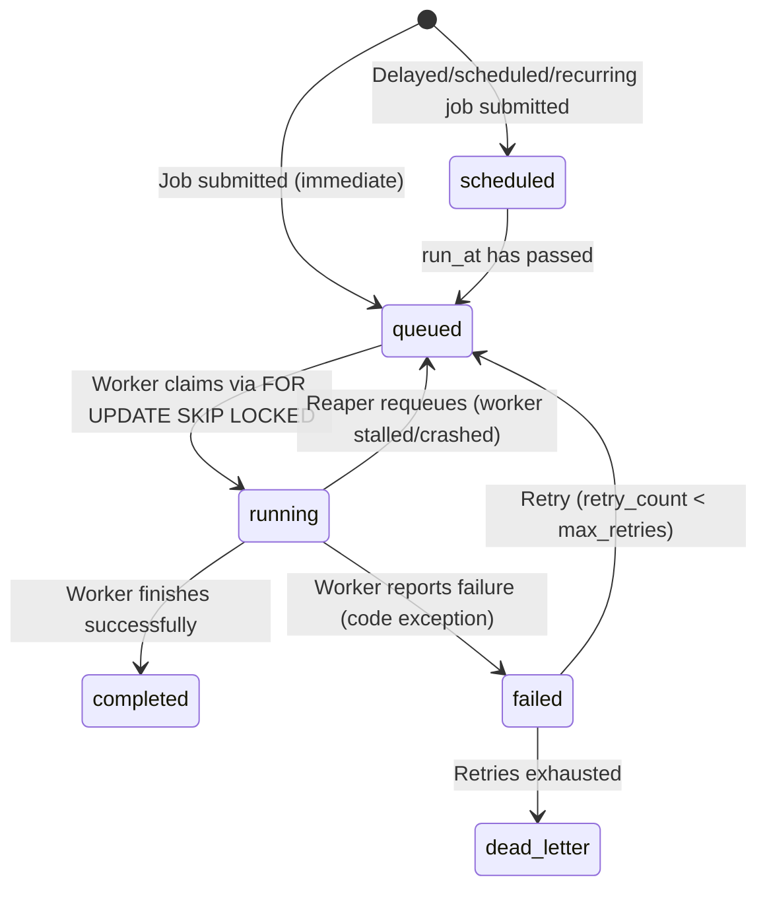
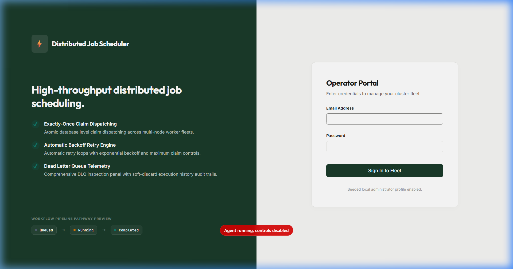
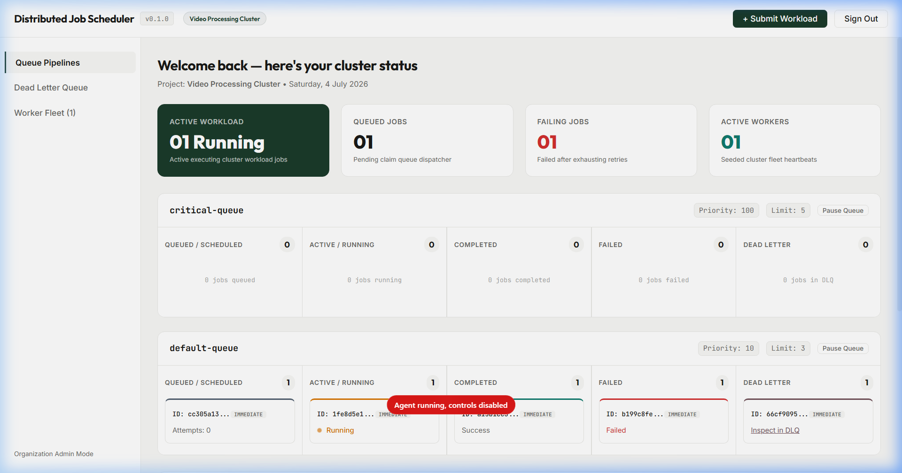
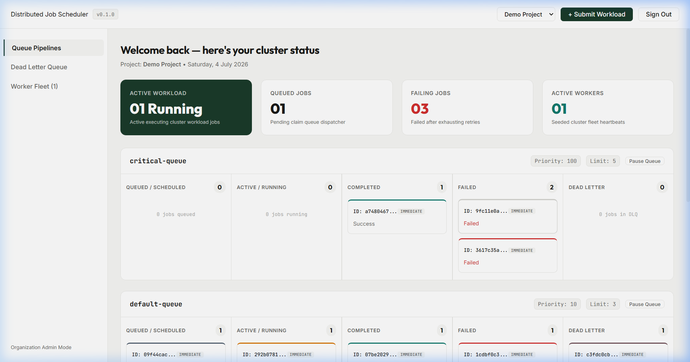
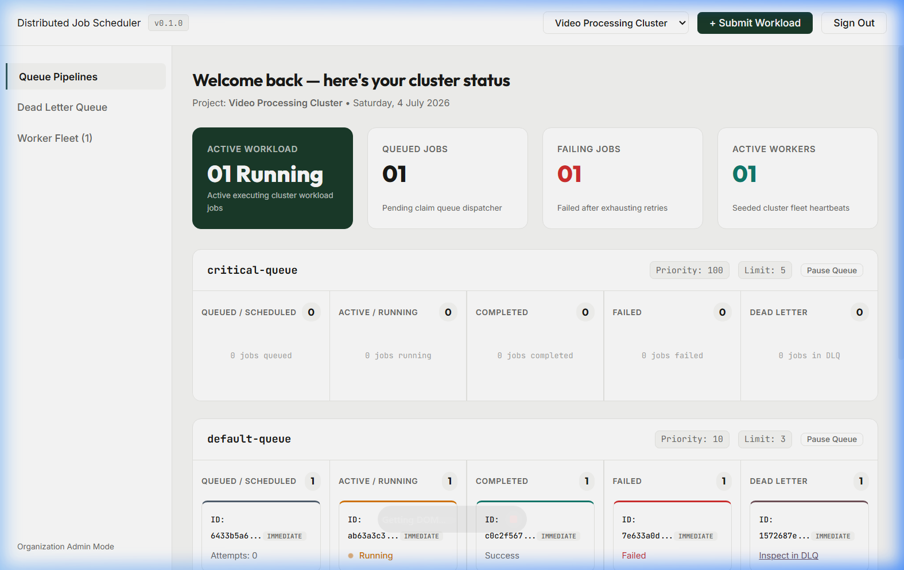
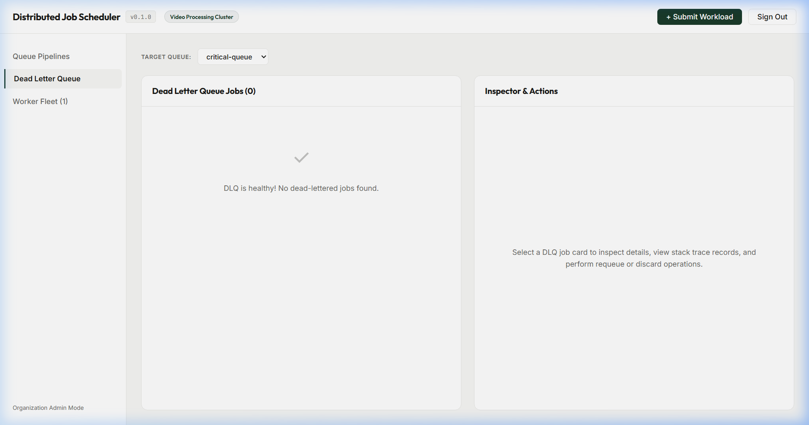
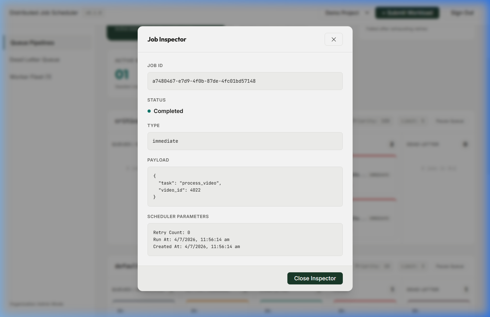
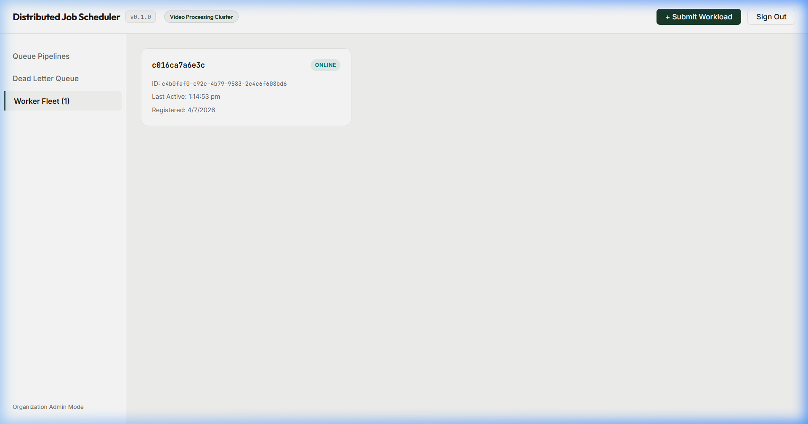
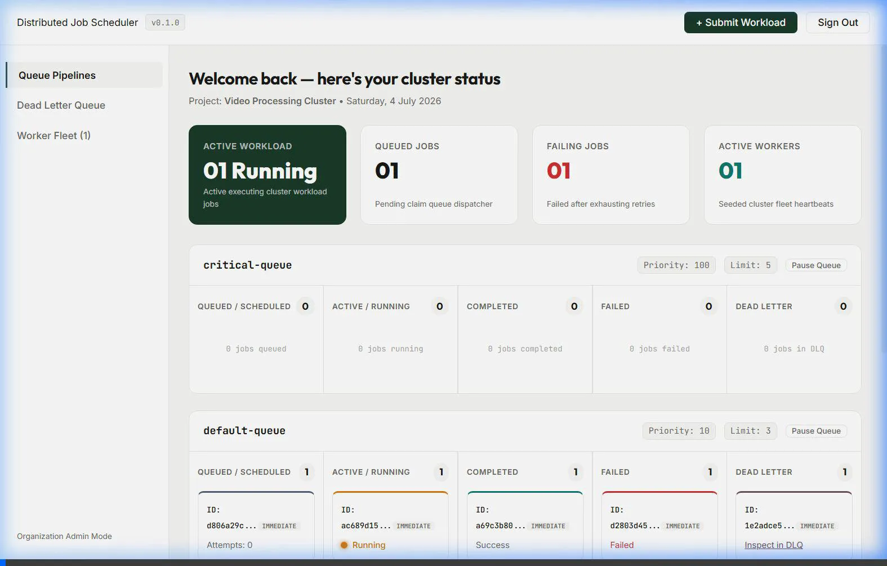

# Distributed Job Scheduler

A production-inspired, highly available distributed job scheduling platform capable of executing asynchronous background tasks reliably across multiple workers with zero lock contention.

[](https://fastapi.tiangolo.com)
[](https://www.postgresql.org)
[](https://react.dev)
[](https://www.docker.com)

---

## Quick Start

Get the entire system running locally in under a minute with zero configuration:

1. **Clone the repository:**
   ```bash
   git clone https://github.com/SakthiV4/distributed-job-scheduler.git
   cd distributed-job-scheduler
   ```

2. **Boot the stack:**
   ```bash
   docker compose up --build
   ```
   *Note: Database migrations run and seed data is created automatically on boot. No manual database setup or `.env` files are required.*

3. **Access the platform:**
   - **Interactive Dashboard:** [http://localhost:8000/dashboard/](http://localhost:8000/dashboard/)
   - **Interactive API Docs:** [http://localhost:8000/docs](http://localhost:8000/docs)
   - **Database Port:** `5432`

4. **Seeded Admin Credentials:**
   - **Email:** `admin@scheduler.xyz`
   - **Password:** `AdminPassword123!`

---

## Architecture & Diagrams

### Core Architecture Flow
```mermaid
graph TD
    Client[Client App] -->|HTTP POST /api/v1/queues/{id}/jobs| API[FastAPI Server]
    API -->|Write/Check Idempotency| DB[(Postgres DB)]
    Reaper[Reaper Thread] -->|Recover Stalled Workers| DB
    Worker1[Worker Fleet node 1] -->|atomic CLAIM FOR UPDATE SKIP LOCKED| DB
    Worker2[Worker Fleet node 2] -->|atomic CLAIM FOR UPDATE SKIP LOCKED| DB
    Worker3[Worker Fleet node 3] -->|atomic CLAIM FOR UPDATE SKIP LOCKED| DB
```

### Job Lifecycle State Machine


---

## Features

- **Multi-Tenant JWT Authentication:** Secure registration, token-refresh, and organization-isolated project access.
- **Horizontal Queue Lanes:** Beautiful signature dashboard visualizing active queues as pipelines moving through job stages.
- **Atomic Job Claiming:** Custom polling engine utilizing Postgres row locks (`FOR UPDATE SKIP LOCKED`) to eliminate polling contention.
- **Stalled Worker Recovery (Reaper):** Automatically detects dead nodes, recovers outstanding jobs, and enforces exponential/linear retry policies.
- **Observability-Safe DLQ Console:** Operator panel to requeue or soft-discard failed jobs (preserving execution histories in full).
- **Queue-Scoped Idempotency:** Duplicate submission safety scoped at the queue level to allow key reuse across workspaces.
- **Live Fleet Telemetry:** Interactive node monitor displaying heartbeat updates and server statistics.
- **Job Dependency DAG:** Advanced DAG gating to prevent children from running before all dependency parents complete.

---

## API Documentation

The API includes comprehensive self-documenting endpoints powered by OpenAPI. Once the stack is running, navigate to [http://localhost:8000/docs](http://localhost:8000/docs) to explore, test, and view schemas.

Key Route Groups:
- `/api/v1/auth/` — Token management, registration, and refresh.
- `/api/v1/projects/` & `/api/v1/queues/` — Tenant resource hierarchies.
- `/api/v1/jobs/` — Job submissions, batch submissions, and detail lookups.
- `/api/v1/dlq/` — Operator dead-letter recovery and discard functions.
- `/api/v1/system/` — Telemetry aggregates and worker list nodes.

---

## Design Decisions & Trade-offs

A comprehensive details write-up is available in the [Design Decisions Document](file:///c:/PROJECT/Distributed_Job_Scheduler/DESIGN_DECISIONS.md).

### Summary:
- **Claimed/Running Consolidation:** We collapsed `claimed` and `running` states to eliminate write amplification (saving 1 database write roundtrip per execution loop).
- **Partial Claim Index:** Built a highly targeted index on jobs `WHERE status IN ('queued', 'scheduled')` to prevent index bloat as completed history records accumulate.
- **Dependency Claim Scanning Trade-off:** Candidate jobs are scanned and evaluated in `run_at` order. A large batch of blocked child jobs at the front of the queue will cause the claiming thread to evaluate the subselect past them. This is an accepted scaling trade-off at this project's scope.

---

## Bonus Feature: Job Dependency DAG

We implemented support for job dependency DAGs (Directed Acyclic Graphs). When submitting a job, you can supply a list of parent job UUIDs via the `depends_on` parameter.

### Rules & Safety Guarantees:
- **Project Boundary Validation:** Jobs can declare dependencies across different queues, but cross-project relationships are strictly blocked.
- **Atomic Gating CTE:** Child jobs are never picked up by workers until all listed parent dependencies have reached a status of `completed`. This is enforced within the atomic `FOR UPDATE SKIP LOCKED` database claim transaction, eliminating any chance of race conditions.

---

## Screenshots

### 1. Unified Authentication

*A redesigned split-screen gateway featuring security authentication.*

### 2. Multi-Lane Operations Dashboard

*Real-time tracking of active pipeline jobs partitioned into horizontal flow columns.*

### 3. Light Theme Redesign

*Consistent light-mode UI styling matching the operations design parameters.*

### 4. Consistent Global Headers

*Global page selector badge displaying synchronized workspace projects across all views.*

### 5. Dead Letter Queue Console

*Detailed operator view rendering stack traces and runtime error details in clean monospace.*

### 6. Job Details Inspector

*Deep inspector details panel displaying payloads, logs, execution attempts, and dependency status links.*

### 7. Active Worker Fleet Telemetry

*Live telemetry node listing rendering hostname details and heartbeat metrics.*

### 8. Interactive Telemetry Visuals

*Active CSS heartbeat pulse animation on actively executing pipeline card lanes.*

---

## Testing

A comprehensive test suite validates all database rules, safety boundaries, and high-concurrency races.

### Executing Tests:
Run all tests inside the API container using:
```bash
docker exec distributed_job_scheduler-api-1 python <test_script_name>.py
```

### Test Suites:
1. **`test_e2e.py`:** Verifies the complete workspace REST pipeline (auth, project cascades, batch jobs, idempotency checks).
2. **`test_worker.py`:** Validates worker claiming loops, queue concurrency limit gating, retries, and DLQ routing.
3. **`test_reaper_backoff.py`:** Simulates worker crashes (SIGKILL), stale heartbeats, reaper reclamation, backoffs, soft-discard, and cross-tenant boundaries.
4. **`test_phase5.py`:** Proves OpenAPI schema models and concurrent registration race integrity handlers.
5. **`test_concurrency_race.py`:** Proves the **Concurrency Guarantee** (3 worker replicas running simultaneously against 60 quick jobs, resulting in exactly-once execution and zero duplicates).
6. **`test_dependencies.py`:** Validates the **Dependency Safety Guarantee** (verifies that children remain gated when dependencies are queued/failed/dead_letter, and exactly-once claim execution once unblocked).
